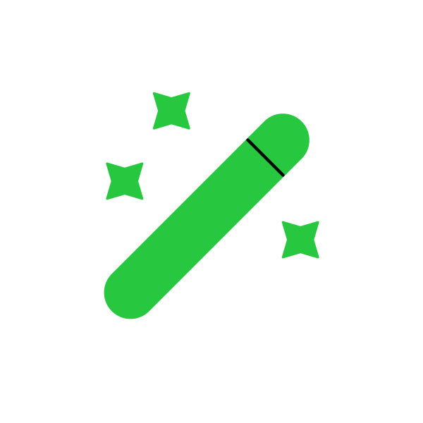
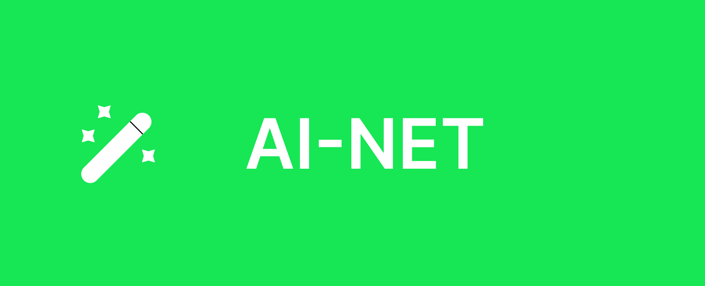

<p align="center">
  
</p>

# AI-Net

<p align="center">
  
</p>

<p align="center">

<a href="https://github.com/e89wrhi/ai-net-web">
  
</a>

<br/>


</p>

A high-performance, **Modular Monolith** ecosystem for AI-driven applications. Built with **.NET 9**, **Aspire**, and enterprise-grade patterns, this platform serves as a robust skeleton for building, scaling, and orchestrating 20+ specialized AI services.

---

## 🏗️ Technical Architecture

This project follows a **Modular Monolith** approach, balancing the simplicity of a single deployment unit with the scalability and isolation of microservices. 

For a deep dive into the system's internal design and boundaries, view the **[System Structure Architecture Guide](./Docs/architecture/000-system-structure.md)**.

- **Orchestration**: [.NET Aspire](./Src/Aspire) binds everything together for a seamless local development experience.
- **Communication**: Asynchronous messaging via **MassTransit** over **RabbitMQ**.
- **Data Persistence**:
  - **Relational**: PostgreSQL (via EF Core) with a structured multi-database approach.
  - **Event Sourcing**: **EventStoreDB** for high-integrity domain event tracking.
- **Patterns**: Strict adherence to **DDD (Domain-Driven Design)**, **CQRS (Command-Query Responsibility Segregation)** via MediatR, and **Outbox/Inbox** patterns for eventual consistency.
- **Observability**: Built-in **OpenTelemetry** with pre-configured exporters for Jaeger, Prometheus, and Grafana.

---

## 🧩 Module Ecosystem

The platform features 20+ functional modules, each isolated to its own domain logic:

| Module | Purpose |
| :--- | :--- |
| **[AiOrchestration](./Src/Modules/AiOrchestration)** | Central gateway for LLM provider management. |
| **[ChatBot](./Src/Modules/ChatBot)** | State-aware AI chat sessions and history. |
| **[CodeGen](./Src/Modules/CodeGen)** | Automated programming and debugging assistance. |
| **[Identity](./Src/Modules/Identity)** | Security foundation using Duende IdentityServer. |
| **[ImageGen](./Src/Modules/ImageGen)** | Multi-provider image generation pipelines. |
| **[Payment](./Src/Modules/Payment)** | Subscription and usage-based billing logic. |
| ... and 15+ others. | [See full module list in Docs.](./Docs/README.md#🧩-modules) |

---

## 🚀 Getting Started

### Prerequisites
- [.NET 10 SDK](https://dotnet.microsoft.com/download/dotnet/10.0)
- [Docker Desktop](https://www.docker.com/products/docker-desktop)
- [.NET Aspire Workload](https://learn.microsoft.com/en-us/dotnet/aspire/fundamentals/setup)

### One-Command Startup
The entire environment, including databases, brokers, and the API, spins up via Aspire:

```bash
# Navigate to the AppHost
cd Src/Aspire/AppHost

# Run the project
dotnet run
```

Once running, navigate to the **Aspire Dashboard** (URL provided in terminal output) to view logs, traces, and metrics.

For detailed instructions on building and scaling for real environments, see the **[Build Setup](./Docs/build/build-project.md)** and **[Production Deployment](./Docs/build/production.md)** guidelines.

### 🛠️ Utility Scripts
Manage 20+ modules with ease using our automated utility scripts:

| Script | Purpose |
| :--- | :--- |
| **`Add-Migrations.ps1`** | Auto-discovers all DbContexts and adds a new migration to all modules simultaneously. |
| **`Update-Databases.ps1`** | Applies all pending migrations to all module databases in one go. |
| **`add-migration.sh`** | Bash version of the migration addition tool. |
| **`update-db.sh`** | Bash version of the database update tool. |

---

## 📂 Project Structure

```text
├── Docs/               # Comprehensive Architecture & User Guides
├── Src/
│   ├── Api/            # Entry point Minimal API
│   ├── Aspire/         # Orchestration (AppHost & ServiceDefaults)
│   ├── Common/         # "Building Blocks" - Shared Infrastructure
│   ├── Modules/        # 20+ Independent Business Modules
│   └── Tests/          # Integration & Unit Test Suites
└── AI.sln              # Master Solution
```

---

## 📖 Documentation
Detailed technical guides and architecture decisions are located in the [**Docs Hub**](./Docs/README.md).

---

## 🛠️ Roadmap
- [ ] Implement production AI providers (OpenAI/Anthropic).
- [ ] Expand integration test coverage using TestContainers.
- [ ] Finalize the automated migration discovery engine.
- [ ] Complete the UI frontend (Web & Admin).

---

Developed with ❤️ for the AI Developer Ecosystem.
